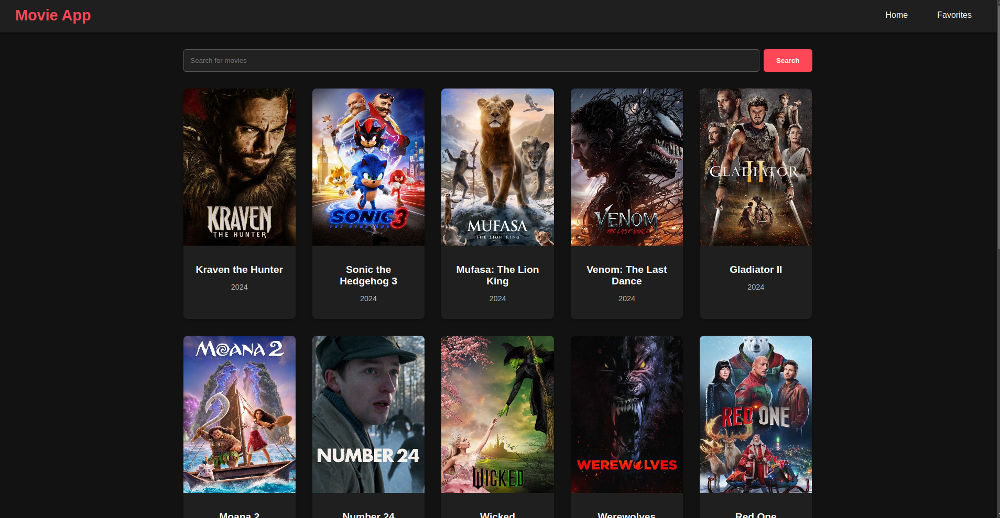

# Simple React App
Live at: [Movie App](https://movie-4m3yb4n5i-pramanandasarkars-projects.vercel.app/)



## Features
1. Search Movies
2. Favorite Movie Management
3. Persistent Favorites in browser localStorage

## Technology Used
1. Vite React app for build and development
2. React Router for navigation
3. Context API for state management
4. CSS for simple styling
5. TMDB API for movie data

## Quick Start
```bash
# Clone the repository
git clone https://github.com/PramanandaSarkar/movie-app.git
cd movie-app

# Install dependencies
npm install
# or
yarn install

# Set up your environment
cp .env.example .env

# Start development
npm run dev
# or
yarn dev
